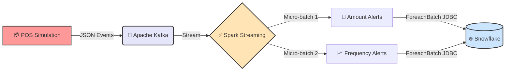

# Gear-Stream
Apache Kafka, Apache Spark, Scala, Databricks, Snowflake, Data Engineering, and Structured Streaming.

<!-- Animated Header Banner -->

<!-- Dynamic Typing Effect -->

 

<!-- Badges -->

---
**A production-ready, highly scalable, and fault-tolerant streaming pipeline for detecting financial fraud in near real-time.**

## 📖 Table of Contents
- [✨ Features](#-features)
- [🏗️ Architecture](#️-architecture)
-[🧰 Tech Stack](#-tech-stack)
- [📂 Project Structure](#-project-structure)
-[🚀 Getting Started](#-getting-started)
- [💻 Usage](#-usage)
- [⚙️ Configuration](#️-configuration)

---

## ✨ Features

- **🌊 Stateful Stream Processing:** Utilizes Spark Structured Streaming with **Watermarking** to handle late-arriving events.
- **⏱️ Sliding Windows:** Identifies high-frequency transaction bursts (e.g., > 3 transactions in a 1-minute rolling window).
- **🛡️ Deduplication:** Bulletproof idempotency using `dropDuplicates` to filter out network retries.
- **🔁 Exactly-Once Guarantees:** Kafka offset checkpointing integrated directly with Snowflake micro-batch commits.
- **🚫 Null & Schema Safety:** Strict schema enforcement to prevent `NullPointerException` (NPE) on corrupted payloads.
- **🔌 Plug-and-Play:** Driven purely by environment variables for easy deployment across Databricks, EMR, or local clusters.

---

## 🏗️ Architecture

The pipeline follows a modern decoupled streaming architecture. Data flows continuously from the simulated point-of-sale through Kafka, into Spark for complex event processing (CEP), and lands securely in Snowflake.

## 🧰 Tech Stack
Component	Technology	Version	Description
Language	 Scala	2.12.18	Functional, statically typed core logic.
Ingestion	 Kafka	3.4.0	Distributed event broker (KRaft mode).
Processing	 Spark	3.4.1	Distributed in-memory compute engine.
Storage	 Snowflake	V2 SDK	Cloud native analytical data warehouse.
Build	 SBT	1.x	Simple Build Tool for dependency management.

## 📂 Project Structure

<b>Click to expand folder tree 📁</b>

code
Text
fraud-pipeline/
├── build.sbt                     # Scala dependencies and build settings
├── docker-compose.yml            # Local Kafka KRaft cluster
├── README.md                     # You are here!
└── src/
    └── main/
        └── scala/
            └── com/
                └── fraudpipeline/
                    ├── models/
                    │   └── Transaction.scala           # Case classes
                    ├── producer/
                    │   └── TransactionProducer.scala   # Kafka data simulator
                    ├── sink/
                    │   └── SnowflakeSinkProvider.scala # DB Connection logic
                    └── streaming/
                        └── FraudDetectionEngine.scala  # Main processing DAG

## 🚀 Getting Started
Prerequisites
Make sure you have the following installed on your machine:
Java 11 (Required for Spark 3.x)
Scala & SBT
Docker & Docker Compose (For local Kafka)
Apache Spark (If running spark-submit locally)

1. Clone the repository
code
Bash
git clone https://github.com/your-username/real-time-fraud-detection.git
cd real-time-fraud-detection

3. Start Kafka Infrastructure (Locally)
Spin up a ZooKeeper-less Kafka (KRaft) instance in seconds:
code
Bash
docker-compose up -d
Check if it's running: docker ps
5. Build the Fat JAR
Compile the code and package it into an Uber-JAR containing all necessary dependencies (Circe, Snowflake SDK, Kafka clients).
code
Bash
sbt clean assembly

## 💻 Usage
We need two terminal windows: one to simulate the transactions, and one to process the stream.
Terminal 1: Run the Kafka Producer Simulator
This simulates a firehose of transactions, injecting random high-value and high-frequency anomalies.
code
Bash
export KAFKA_BROKERS="localhost:9092"
export KAFKA_TOPIC="transactions"

java -cp target/scala-2.12/fraud-detection-pipeline-assembly-1.0.0.jar \
  com.fraudpipeline.producer.TransactionProducer
(You should see JSON events streaming across the console!) 💸
Terminal 2: Run the Fraud Detection Spark Job
Before running, set up your Snowflake credentials.
code
Bash
# Core Pipeline Configs
export KAFKA_BROKERS="localhost:9092"
export KAFKA_TOPIC="transactions"
export CHECKPOINT_DIR="/tmp/fraud_checkpoints"

# Snowflake Plug-and-Play Credentials
export SF_URL="<your-account>.snowflakecomputing.com"
export SF_USER="<your-username>"
export SF_PASSWORD="<your-password>"
export SF_DATABASE="FRAUD_DB"
export SF_SCHEMA="PUBLIC"

# Submit Job
spark-submit \
  --class com.fraudpipeline.streaming.FraudDetectionEngine \
  --master "local[*]" \
  target/scala-2.12/fraud-detection-pipeline-assembly-1.0.0.jar
 

<i>Watch the stream process anomalies in real-time!</i>

## ⚙️ Configuration Reference
Environment Variable	Default Value	Description
KAFKA_BROKERS	localhost:9092	Kafka Bootstrap servers
KAFKA_TOPIC	transactions	Topic for inbound transactions
CHECKPOINT_DIR	/tmp/checkpoints	Fault-tolerance state directory
SF_URL	None	Snowflake Account URL
SF_USER	None	Snowflake Username
SF_PASSWORD	None	Snowflake Password / Private Key
SF_WAREHOUSE	COMPUTE_WH	Execution Warehouse
SF_DATABASE	FRAUD_DB	Target Database
SF_SCHEMA	PUBLIC	Target Schema

## ☁️ Databricks Deployment Notes
To run this in a production Databricks environment:
Do not use local export for credentials.
Store your Snowflake keys inside Databricks Secret Scopes.
Point CHECKPOINT_DIR to a durable DBFS or S3 path (e.g., s3://my-bucket/checkpoints/fraud/).
Attach the JAR to your Cluster and set the Main Class to com.fraudpipeline.streaming.FraudDetectionEngine.

<b>Built with ❤️ for Data Engineers</b>  
If you found this helpful, drop a ⭐️ on the repo!

